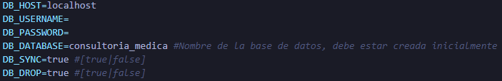

# Backend


## 💻 Pre-requisitos

- MySQL
- Windows / Linux / Mac.

## 🚀 Instalación

1. En el archivo [.env](./.env) complete los datos de conexión a su base de datos.


2. En el archivo [constants.ts](./src/auth/constants.ts) setee una palabra secreta para que funcione jwt


3. Para instalar las dependencias requeridas
```
npm install
```

4. Luego, ejecute el siguiente comando:
```
npm start
```